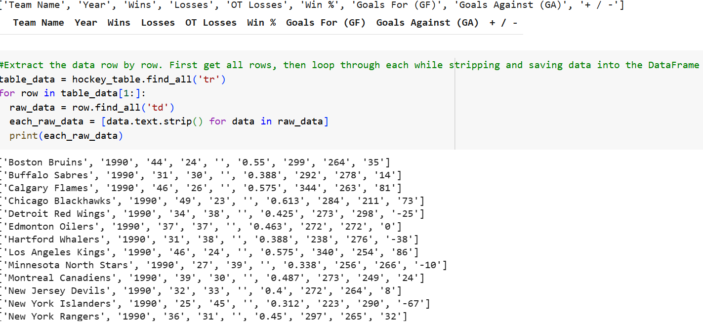

# 🏒 Web Scraping Hockey Team Statistics with Python

This project demonstrates how to collect and clean sports team data from a public website using Python tools like `requests`, `BeautifulSoup`, and `pandas`.

---

## 📚 Overview

As part of the **Cyber Shujaa Program – Week 1 Assignment**, this lab involved scraping a table of hockey team statistics from [ScrapeThisSite](https://scrapethissite.com), cleaning the data, and exporting it to a CSV file.

The notebook walks through the process of:
- Connecting to the webpage
- Extracting tabular data
- Cleaning and formatting it
- Saving the result into `Hockey.csv`

---

## 🧰 Tools Used

- **Google Colab** (Jupyter Notebooks)
- **Python 3**
  - `requests`
  - `BeautifulSoup4`
  - `pandas`

---

## 📌 Project Goals

- Practice Python scripting in Google Colab
- Scrape data from an HTML table
- Clean and structure scraped data using `pandas`
- Export cleaned data into a `.csv` file for future analysis

---

## 📋 Tasks Completed

1. **Imported Libraries**  
   `requests`, `BeautifulSoup`, and `pandas`

2. **Accessed the Website**  
   Opened the URL using `requests.get()` and verified the response

3. **Parsed HTML Content**  
   Used `BeautifulSoup(html.parser)` to find the data table

4. **Extracted Table Data**  
   Pulled headers (`<th>`) and rows (`<td>`) into a DataFrame

5. **Saved the Data**  
   Cleaned and exported it as `Hockey.csv`

---

## 📎 View the Notebook

[🔗 Open in Google Colab](https://colab.research.google.com/drive/1BmNb2KZI6T0M_5n6b3ZweDBukuraUCby?usp=sharing)

---
## ✅ Sample Output

After scraping and cleaning the data from [ScrapeThisSite](https://scrapethissite.com/pages/forms/), the final output is a structured table of hockey team statistics.

Here’s a preview of the DataFrame shown in the notebook:




The data was exported to a file called `Hockey.csv`. Here's what a preview of the final table looks like:

| Team Name           | Year | Wins | Losses | OT Losses | Goals For | Goals Against |
|---------------------|------|------|--------|-----------|-----------|----------------|
| Boston Bruins       | 2011 | 49   | 29     | 4         | 259       | 202            |
| Chicago Blackhawks  | 2011 | 45   | 34     | 3         | 248       | 220            |
| Vancouver Canucks   | 2011 | 54   | 19     | 9         | 262       | 185            |

> 🗂️ This table was generated using `pandas` and then saved with:
> ```python
> df.to_csv("Hockey.csv", index=False)
> ```

---
